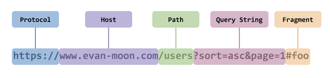
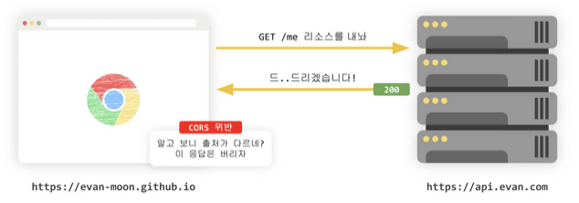
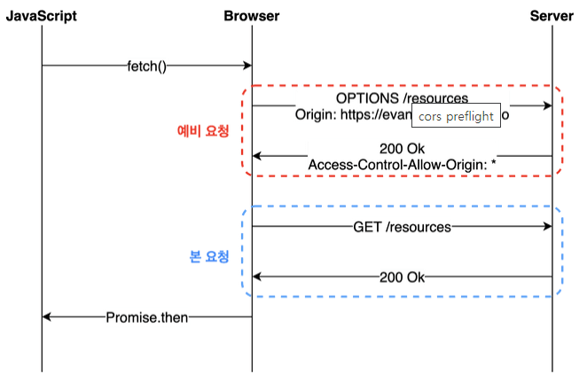
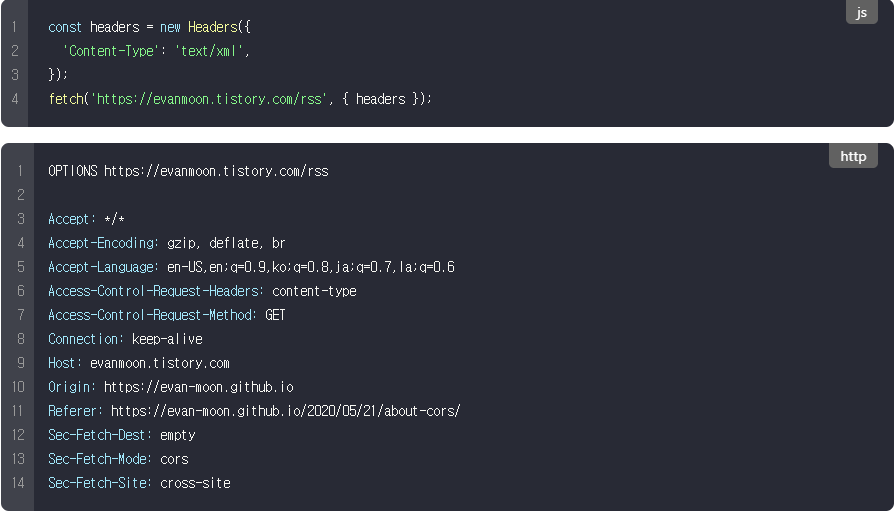
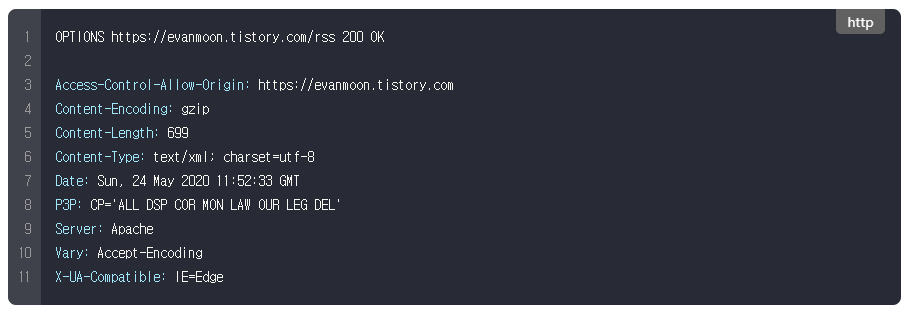
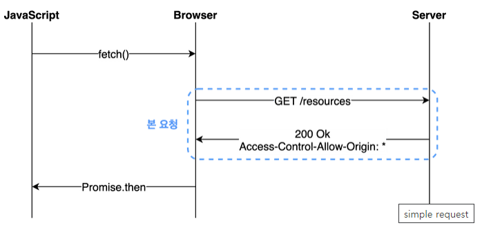

# CORS
> Cross Origin Resource Sharing  
> 다른 출처의 리소스 공유하기  
> 브라우저 상에서 나타나는 문제 

- 악성 홈페이지에 접속하면 해당 홈페이지의 소스코드가 브라우저에 다운로드 됨. 이때 내 크롬 내 인증 정보를 빼낼 수 있기 때문에 이를 방지하게 위해 사용한다.

- 다른 출처의 리소스는 신뢰가 어렵기 때문에 ```CORS``` 를 지켜야 사용할 수 있다.  
- 클라이언트 웹 브라우저의 경우 개발자 도구만 사용해도 모든 소스코드를 열람할 수 있기 때문에 ```CORS``` 와 같은 방어책이 필요하다.  

## Origin ( 출처 ) 이란 ?
> 서버의 위치를 찾아가기 위해 필요한 가장 기본적인 것  

아래와 같은 URL 사진이 있다 가정한다.
   

여기서 출처는 ```Protocol```, ```Host```, ```Port``` 를 합친 것을 의미한다.  
즉, ```Protocol```, ```Host```, ```Port(브라우저 구현에 따라 다름)``` 세가지가 같아야 같은 출처  

서버의 경우 같은 출처 상관 없이 응답하지만, 브라우저의 경우 응답을 받았을 시 파기 여부를 결정한다.  

  

## SOP 이란 ? 
> Same Origin Policy  
- 같은 출처에서만 리소스를 공유 가능  
- CORS 를 지킨 리소스는 공유할 수 있음  

## CORS 동작

웹 클라이언트 어플리케이션이 다른 출처의 리소스를 요청할 때 HTTP 프로토콜을 사용하여 요청을 보낸다  

- 이 때 브라우저는 요청 헤더에 Origin 출처를 같이 담아 보낸다.
- ```Origin : https://domain.com```  

**서버가** 요청에 대한 응답을 할 때 응답 헤더의 ```Access-Control-Allow-Origin``` 이라는 값에 **리소스 접근 허용** 출처를 내려주고, 이후 **응답을 받은 브라우저** 는 자신이 보냈던 요청의 ```Origin``` 과 서버가 보내준 응답의 ```Access-Control-Allow-Origin``` 을 **비교** 해본 후 이 응답이 유효한 응답인지 아닌지 결정한다.  

## Preflight Request
> 예비 요청  
> 웹 어플리케이션 개발 시 일반적으로 가장 많이 다뤄지는 시나리오  

- 브라우저가 서버로 요청을 보낼 시 본 요청을 보내기 전에 보내는 예비 요청  
- ```HTTP Method OPTIONS``` 가 사용됨
  

이 떄 브라우저는 Access-Control-Request-Header, Method 등 Content-Type, GET POST 등 자신이 요청할 정보를 같이 서버로 보낸다.  

  

예비 요청을 위 처럼 받은 서버는 아래와 같이 응답을 해준다.



위 정보 중 ```Access-Control-Allow-Origin:``` 에 해당하는 출처(값) 만 서버에 접근이 가능하다.  

즉, 브라우저의 ```Origin``` 은 ```https://evan-moon.github.io``` 이며, 서버에서 허용한 ```Origin``` 과 다르므로 다른 출처 즉, ```CORS``` 정책을 위반했다.  

이떄 중요한 것은 정책을 판단하는 시점은 **브라우저가 예비 요청에 대한 응답을 받은 이후** 이기 때문에 ```http.status``` 는 ```200``` 이 나올 수 있다.  
즉, 상태 코드가 아닌 ```Access-Control-Allow-Origin``` 값이 존재하는지 여부가 중요하다  

## Simple Request
> 예비 요청을 보내지 않고 바로 본 요청을 보내는 것  

시나리오는 아래 사진과 같다.  
  

위 시나리오는 특정 조건을 만족하는 경우만 시행되며, 조건이 까다롭기 때문에 일반적으로 자주 사용되지는 않다.  

- 조건
1. 요청 가능 메소드는 GET HEAD POST 중 하나
2. ```Accept```, ```Accept-Language```, ```Content-Type```, ```DPR```, ```Downlink, Save-Data```, ```Viewport-Width```, ```Width``` 헤더만 사용 가능
3. ```Content-Type``` 의 경우 ```application/x-www-form-urlencoded```, ```multipart/form-data```, ```text/plain``` 만 허용

## Crendentialed Request
> 인증된 요청을 사용하는 방법
> 쿠키정보, 인증관련 헤더를 ```Request``` 객체에 담을 수 있게 해주는 옵션  


- credential 종류   

|옵션값|설명|
|--|--|
|same-origin(default)|같은 출처 간 요청만 인증 정보를 담을 수 있다|
|include|모든 요청에 인증 정보를 담을 수 있다|
|omit|모든 요청에 인증 정보를 담지 않는다|

이 중 ```same-origin```, ```include``` 옵션을 사용한다면, 브라우저는 ```Access-Control-Allow-Origin``` 만 확인하지 않는다.  ( 다른 검사 조건 추가 )  

- ```Access-Control-Allow-Origin : *``` , ```credentials : same-origin``` 일 경우   
    - 이 경우 다른 출처 모두 허용이기 때문에 어느 곳이던 리소스 요청 가능
    - ```same-origin``` 이기 때문에 같은 출처일 경우면 인증정보를 확인한다.  

즉, 안전한 정보로 결론을 내린다.

- ```Access-Control-Allow-Origin : *``` , ```credentials : include ``` 일 경우 
    - ```include``` 는 모든 요청에 인증 정보를 담을 수 있음
    - 따라서 출처에 상관없이 인증 정보 검토 
 